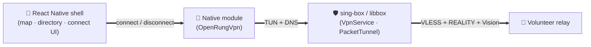

<div align="center">

<a href="https://openrung.org">
  
</a>

# OpenRung Mobile App

**Reach the open internet, from your phone.**

The OpenRung cross-platform mobile client: a React Native control shell on top
of a **production-equivalent native VPN path** — Android `VpnService` and iOS
`NEPacketTunnelProvider`, both driving the sing-box/libbox engine.

OpenRung is a volunteer-powered relay network that helps people living behind
internet censorship reach blocked websites and apps.

[](https://openrung.org)
[](LICENSE)
[](package.json)
[](#building)
[](src/i18n)

[Website](https://openrung.org) · [Architecture](docs/ARCHITECTURE.md) · [Native contract](docs/CONTRACT.md) · [Report an issue](https://github.com/openrung/openrung-mobile-app/issues)

</div>

---

## How it works

The app is a thin, well-designed TypeScript shell over a native VPN engine. The
shell handles everything the user sees — the map, relay directory, and connect
UI — while the native module carries the actual traffic.

OpenRung is **availability-first**: it optimizes for keeping you reachable rather
than guaranteeing zero leakage. If no relay can be reached the app reports the
failure and leaves your normal connection in place instead of blocking it — there
is no OS-level kill switch.



The broker URL, relay selection rules (`vless-reality-vision`,
`xtls-rprx-vision`, `exit_mode=direct`, expiry checks), sing-box config
generation, and telemetry JSON shapes are **identical to the production OpenRung
clients**. App and bundle ids are `com.openrung.mobile`, so this app installs
side-by-side with them.

## Highlights

- 🗺️ **Full-screen exit-node map** — the MapLibre map *is* the home screen:
  crisp in the center, dissolving into the dark backdrop toward the edges, and
  pannable/pinch-zoomable throughout. Tap a country marker to connect through a
  volunteer there.
- 🪟 **Floating connect card** — a glass panel with a live status row (pulsing
  indicator + relay location) and the primary CONNECT/DISCONNECT action.
- 🧭 **Translucent tab bar** — Home / Settings / About us, floating over the map.
- 🌃 **Terminal cyberpunk theme** — the production green-on-black palette
  (`#65F58A` on `#030604`), all-monospace type, neon glows and HUD accents.
- 🌍 **10 locales** — persisted per-app language selection.
- 🕳️ **Direct CGNAT volunteers on Android** — NAT punching establishes a
  client↔volunteer QUIC path and keeps RelayHub out of the data plane whenever
  both NATs permit it, with certificate-pinned coordination, end-to-end health
  monitoring, and automatic hub fallback otherwise.
- 🧪 **Demoable without a native build** — a scripted mock engine drives the UI
  through the full connect lifecycle so you can develop and demo with no device.

## What's included

- **TypeScript shell (`src/`, `App.tsx`)** — all screens (home, settings,
  about, debug, licenses), the exit-node map (MapLibre), broker directory fetch
  + GeoIP grouping, speed test, and language selection.
- **Android native (`android/`)** — the production `VpnService` connect path
  (package `com.openrung.*`): broker relay fetch, relay selection + TCP
  reachability, direct NAT punching for CGNAT volunteers, sing-box/libbox engine,
  TUN + DNS, internet probe, connection-failure handling, heartbeat telemetry,
  plus the `OpenRungVpn` React Native module that bridges it.
- **iOS native (`ios/`)** — the production `NEPacketTunnelProvider` extension,
  shared Swift sources compiled into both targets, and an `OpenRungVpnModule`
  bridging `NETunnelProviderManager` + app-group shared state to React Native.
  The Xcode project is generated by xcodegen.
- **Mock native module (`src/native/mock.ts`)** — automatically used when the
  native module is absent (Jest, Metro without a native build): a scripted
  simulator that walks preparing → connecting → connected with fake log lines,
  so the UI is demoable without native builds. The Debug screen shows when the
  mock is active.

## Repository layout

```text
App.tsx              Route enum navigation, back handling, safe areas.
src/config.ts        Port of AppConfig.kt (same constant names/values).
src/i18n/            Language provider + strings for 10 locales.
src/model/           Relay descriptor, country centroids, exit-node types.
src/net/             Broker, GeoIP, speed-test, telemetry clients.
src/state/           App store + native-event wiring.
src/native/          Bridge types, module accessor, mock simulator.
src/screens/         Main, Settings, Debug, Licenses, LicenseText.
src/components/      Map, status chip, recents, panels, header.
src/licenses/        Bundled license text for the in-app screen.
android/             RN Android app + ported VPN service and bridge.
  punchbridge/       Go punch client injected into the generated libbox AAR.
ios/                 RN iOS app + PacketTunnel extension (xcodegen).
docs/                CONTRACT.md (binding), ARCHITECTURE.md (overview).
```

## Building

Prerequisites: Node ≥ 22.11 and a working React Native 0.86 environment (see the
RN [environment setup](https://reactnative.dev/docs/set-up-your-environment)).

```sh
npm install
```

### Android

The app expects a locally generated sing-box/libbox AAR at:

```text
android/app/libs/libbox.aar
```

The AAR is intentionally ignored by Git because it is generated and large. Build
it from the pinned sing-box revision (in `SINGBOX_VERSION`) plus the committed
Android NAT-punch source (`android/punchbridge`) with
[`android/build-libbox-release.sh`](android/build-libbox-release.sh) — it needs
JDK 17, the Android SDK + NDK `29.0.14206865`, and Go on `PATH`. The sing-box
revision and this repository commit together are the GPL §6 corresponding source
for the shipped native engine; the per-release procedure is in
[`RELEASE.md`](RELEASE.md).

Install sing-box's pinned gomobile fork before the first native build:

```sh
go install github.com/sagernet/gomobile/cmd/gomobile@v0.1.12
go install github.com/sagernet/gomobile/cmd/gobind@v0.1.12
```

The native Android source set requires this generated AAR. Jest/Metro UI work can
still use the mock module without building it.

You also need `android/local.properties` with your SDK path
(`sdk.dir=/Users/<you>/Library/Android/sdk`), or `ANDROID_HOME` exported. Build
with JDK 17.

```sh
npm run android
```

### iOS

The Xcode project is generated by xcodegen (the RN template project plus the
`PacketTunnel` app-extension target):

```sh
brew install xcodegen
./ios/scripts/generate-project.sh   # xcodegen generate + bundle exec pod install
```

(Run `bundle install` once first to install CocoaPods via the Gemfile.)

The tunnel extension expects a locally generated framework at:

```text
ios/ThirdParty/Libbox.xcframework
```

Also Git-ignored. Build it from the same pinned sing-box revision per
[`ios/ThirdParty/README.md`](ios/ThirdParty/README.md) and copy it into
`ios/ThirdParty/`. The extension compiles without it via a
`#if canImport(Libbox)` stub, but cannot carry traffic.

**Signing:** both targets need a development team (production uses `9VLV9A7KS9`)
with the **Network Extension (packet-tunnel-provider)** capability and the app
group `group.com.openrung.mobile`. Bundle ids are `com.openrung.mobile` (app)
and `com.openrung.mobile.PacketTunnel` (extension).

> [!NOTE]
> **Simulator limitation:** the iOS simulator runs the UI, map, and relay
> directory, but the Connect path fails by design — installing or starting a
> packet-tunnel VPN profile requires a signed physical device
> (`NEConfigurationErrorDomain Code=11 "IPC failed"` in the simulator).

```sh
npm run ios
```

## Running

```sh
npm start            # Metro
npm run android      # build + install + launch on Android
npm run ios          # build + install + launch on iOS
npm test             # Jest (uses the mock native module)
```

When the native `OpenRungVpn` module is not present in the binary (e.g. Metro
attached to a stale build, or tests), the shell automatically falls back to the
mock simulator — useful for UI work and demos, but no traffic is routed.

## Documentation

| Document | What it covers |
| --- | --- |
| [Architecture](docs/ARCHITECTURE.md) | Readable overview of the shell, native path, and data flow |
| [Native contract](docs/CONTRACT.md) | Binding native-bridge design document |
| [Release process](RELEASE.md) | Per-release sing-box pin and source-offer procedure |
| [iOS ThirdParty](ios/ThirdParty/README.md) | Building the `Libbox.xcframework` |

## Known limitations

- Speed test TTFB/throughput is measured via whole-body fetch (RN `fetch` cannot
  stream progressively).
- In-app language switch does not relayout RTL (fa/ar) without an app restart.
- iOS simulator: UI + map + directory work; connect fails by design
  (NetworkExtension requires a signed device build).
- iOS does not yet consume `punch_capable`; CGNAT volunteers use RelayHub there.
- Telemetry from TypeScript covers only speed-test events; the native connect
  path keeps full production telemetry.

## License

The OpenRung mobile app is licensed under the **GNU General Public License v3.0
or later** (GPL-3.0-or-later). See [`LICENSE`](LICENSE).

The apps statically link [sing-box](https://github.com/SagerNet/sing-box)
(GPL-3.0-or-later), so the combined apps — and this repository as a whole — are
GPL-3.0-or-later, same as the production OpenRung project. Third-party
components bundled or linked into the apps, and the attribution obligations they
carry, are documented in [`THIRD_PARTY_NOTICES.md`](THIRD_PARTY_NOTICES.md).
Complete corresponding source for any released binary is available from this
repository.

## Acknowledgements

The OpenRung mobile app builds on excellent open source work:

- [sing-box](https://github.com/SagerNet/sing-box) — the tunnel engine driven by
  the native VPN path
- [MapLibre](https://maplibre.org/) — the exit-node map
- [React Native](https://reactnative.dev/) — the cross-platform app shell

OpenRung is not affiliated with or endorsed by the sing-box or MapLibre
projects; their names are used descriptively.
