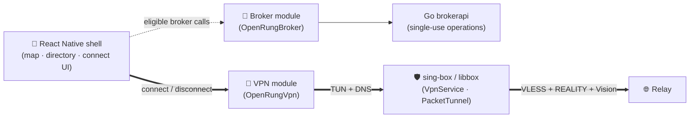

<div align="center">

<a href="https://openrung.org">
  
</a>

# OpenRung Mobile App

**Reach the open internet, from your phone.**

The OpenRung cross-platform mobile client: a React Native control shell on top
of a **production-equivalent native VPN path** — Android `VpnService` and iOS
`NEPacketTunnelProvider`, both driving the sing-box/libbox engine.

OpenRung is a nonprofit relay network with relays operated by its Foundation
and community volunteers. It helps people living behind internet censorship
reach blocked websites and apps.

[](https://openrung.org)
[](LICENSE)
[](package.json)
[](#building)
[](src/i18n)

[Website](https://openrung.org) · [Architecture](docs/ARCHITECTURE.md) · [Native contract](docs/CONTRACT.md) · [Report an issue](https://github.com/openrung/openrung-mobile-app/issues)

</div>

---

## How it works

The app is a thin, well-designed TypeScript shell over a native VPN engine. The
shell handles everything the user sees — the map, relay directory, and connect
UI — while native modules carry VPN commands and eligible broker control-plane
requests. `OpenRungVpn` owns the VPN lifecycle; the separate
`OpenRungBroker` module exposes only directory discovery, speed test, speed-test
telemetry, and the two broker-hosted manifest candidates. WSS tickets and
credentials never cross the React Native bridge. Native discovery projects the
verified relay envelope to directory data before resolving JavaScript and
removes the VPN-only `wss_fronts` field, so WSS front URLs stay native too.

Eligible direct broker requests attempt opportunistic ECH with verified
ordinary-TLS fallback. This is not a guarantee that ECH is available on every
attempt or that SNI is never visible.

OpenRung is **availability-first**: it optimizes for keeping you reachable rather
than guaranteeing zero leakage. If no relay can be reached the app reports the
failure and leaves your normal connection in place instead of blocking it — there
is no OS-level kill switch.


```mermaid
flowchart LR
    ui["📱 React Native shell<br/>(map · directory · connect UI)"]
    bridge["🔌 VPN module<br/>(OpenRungVpn)"]
    brokerBridge["🔐 Broker module<br/>(OpenRungBroker)"]
    brokerapi["Go brokerapi<br/>(single-use operations)"]
    engine["🛡️ sing-box / libbox<br/>(VpnService · PacketTunnel)"]
    relay["🌐 Relay"]

    ui == "connect / disconnect" ==> bridge
    ui -. "eligible broker calls" .-> brokerBridge
    brokerBridge --> brokerapi
    bridge == "TUN + DNS" ==> engine
    engine == "VLESS + REALITY + Vision" ==> relay
```

The broker URL, relay selection rules (`vless-reality-vision`,
`xtls-rprx-vision`, `exit_mode=direct`, expiry checks), sing-box config
generation, and telemetry JSON shapes are **identical to the production OpenRung
clients**. The prototype IDs are `com.openrung.mobile` on Android and
`com.openrung.app` on iOS, so it installs side-by-side with production.

## Highlights

- 🗺️ **Full-screen exit-node map** — the MapLibre map *is* the home screen:
  crisp in the center, dissolving into the dark backdrop toward the edges, and
  pannable/pinch-zoomable throughout. Tap a country marker to connect through a
  relay there.
- 🪟 **Floating connect card** — a glass panel with a live status row (pulsing
  indicator + relay location) and the primary CONNECT/DISCONNECT action.
- 🧭 **Translucent tab bar** — Home / Settings / About us, floating over the map.
- 🌃 **Terminal cyberpunk theme** — the production green-on-black palette
  (`#65F58A` on `#030604`), all-monospace type, neon glows and HUD accents.
- 🌍 **10 locales** — persisted per-app language selection.
- 📦 **Offline Android sharing** — send the installed, signed APK through the
  system sharesheet to Quick Share or any compatible nearby-transfer app; no
  network or storage permission is required.
- 🕳️ **Direct volunteer-run CGNAT relays** — Android and iOS NAT punching establish
  a client↔relay QUIC path and keeps RelayHub out of the data plane whenever
  both NATs permit it, with certificate-pinned coordination, end-to-end health
  monitoring, and automatic hub fallback otherwise.
- 🌐 **Signed per-relay WSS/CDN fallback** — a remote direct-path
  failure can use a short-lived front-bound ticket and the pinned wsscore
  transport, including SNI-less native CloudFront access, while Reality remains
  end-to-end and local failures stay local.
- 🔐 **Native broker transport** — directory, speed-test telemetry, speed test,
  and broker-hosted manifest candidates use the same Go `brokerapi` runtime as
  the VPN services, with single-use cancellation-safe operations and no
  production JavaScript network fallback.
- 🔀 **Preset split tunneling** — on by default, bypassing the local network,
  plus Iranian or Chinese sites & apps (bundled sing-box rule sets) on devices
  that are actually in those countries — a preset is never enabled where it
  would only push ordinary traffic out of the tunnel, and the two are mutually
  exclusive. Either is one tap away anywhere. On Android, users can also bypass
  individual apps. Changes apply live via a quick reconnect, and the routing
  choices last for the session: closing the app returns the master switch, LAN
  bypass and country presets to the default, so a temporary bypass can never
  quietly outlive the reason for it. Bypassed apps are remembered, since those
  are a lasting statement about an app rather than a routing tweak. A bad config
  or missing rule set degrades to full tunnel — it never breaks connect.
- 🧪 **Demoable without a native build** — a scripted mock engine drives the UI
  through the full connect lifecycle so you can develop and demo with no device.

## What's included

- **TypeScript shell (`src/`, `App.tsx`)** — all screens (home, settings,
  about, debug, licenses), the exit-node map (MapLibre), relay snapshot
  decoding + grouping, speed-test telemetry event construction, manifest
  signature verification, and language selection.
- **Android native (`android/`)** — the production `VpnService` connect path
  (package `com.openrung.*`): broker relay fetch, relay selection + TCP
  reachability, direct NAT punching for volunteer-run CGNAT relays, direct-first
  WSS/CDN fallback through signed fronts,
  sing-box/libbox engine,
  TUN + DNS, internet probe, connection-failure handling, heartbeat telemetry,
  the `OpenRungVpn` React Native module that bridges it, the separate
  `OpenRungBroker` module, and a separate
  read-only installed-APK provider for offline sharing.
- **iOS native (`ios/`)** — the production `NEPacketTunnelProvider` extension,
  shared Swift sources compiled into both targets, NAT-punch-first RelayHub
  access and direct-first WSS/CDN fallback, an `OpenRungVpnModule` bridging
  `NETunnelProviderManager` + app-group shared state to React Native.
  `OpenRungBroker` is a separate classic module over the shared brokerapi
  adapter and never exposes WSS tickets.
  The Xcode project is generated by xcodegen.
- **VPN lifecycle mock (`src/native/mock.ts`)** — used only for the existing
  `OpenRungVpn` UI simulator when that module is absent (Jest, Metro without a
  native build). `OpenRungBroker` has no production mock or network fallback.

## Repository layout

```text
App.tsx              Route enum navigation, back handling, safe areas.
src/config.ts        Port of AppConfig.kt (same constant names/values).
src/i18n/            Language provider + strings for 10 locales.
src/model/           Relay descriptor, country centroids, exit-node types.
src/net/             Broker, GeoIP, speed-test, telemetry clients.
src/state/           App store + native-event wiring.
src/native/          Bridge types, module accessor, mock simulator.
src/screens/         Main, Settings, Debug, Licenses, LicenseText.
src/components/      Map, status chip, recents, panels, header.
src/licenses/        Bundled license text for the in-app screen.
android/             RN Android app + ported VPN service and bridge.
  punchbridge/       Go gomobile adapters over pinned brokerapi, punchcore, and
                     wsscore modules, injected into the generated libbox AAR.
ios/                 RN iOS app + PacketTunnel extension (xcodegen).
testdata/contract/   Contract vectors vendored from openrung/openrung, with the
                     pinned ref in pin.json. See "Contract vectors" below.
docs/                CONTRACT.md (binding), ARCHITECTURE.md (overview).
```

### Contract vectors

`testdata/contract/` holds golden vectors that four suites across two repos run
against the same expectations: the failure-classification token set, the
relay-directory decode, and the broker-front list. They are **copies** —
`contract/vectors/` in `openrung/openrung` is the only source of truth, and
`pin.json` records the ref they came from plus a digest per file.

```bash
npm run contract:check   # local digests + byte-identical to the pinned ref
npm run contract:sync    # re-vendor from the pinned ref after moving it
```

Fix a vector upstream, then move the ref and re-sync here; editing a vendored
copy in place makes `contract:check` fail. The check runs in CI and needs
network on purpose: a copy that has quietly drifted from upstream is exactly
what it exists to catch, so an unreachable upstream fails rather than passing.

The suites that consume them are `__tests__/contract/` (Jest),
`ContractClassificationVectorsTest` / `ContractBrokerFrontsTest` (Android unit
tests, run by `android-unit-test.yml`), and `ContractClassificationVectorsTests`
/ `ContractBrokerFrontsTests` (XCTest, run locally — there is no iOS CI job).
Each file's `suites` field says which suites the contract expects; `pin.json`
records which of those this repo runs today and, for any it does not yet, the
reason. `contract:check` fails on a declared consumer that is neither.

## Building

Prerequisites: Node ≥ 22.11 and a working React Native 0.86 environment (see the
RN [environment setup](https://reactnative.dev/docs/set-up-your-environment)).

```sh
npm install
```

### Android

The app expects a locally generated sing-box/libbox AAR at:

```text
android/app/libs/libbox.aar
```

The AAR is intentionally ignored by Git because it is generated and large. Build
it from the pinned sing-box revision (in `SINGBOX_VERSION`), the committed
Android native adapters (`android/punchbridge`), and the shared broker, punch,
and WSS implementations consumed as the pinned
`github.com/openrung/openrung/brokerapi`,
`github.com/openrung/openrung/punchcore`, and
`github.com/openrung/openrung/wsscore` Go modules, with
[`android/build-libbox-release.sh`](android/build-libbox-release.sh) — it needs
JDK 17, the Android SDK + NDK `29.0.14206865`, and Go and `python3` on `PATH`
(python3 extracts all three pins from `go.mod`). The sing-box revision, this
repository commit, and all three pinned module versions together are the GPL §6
corresponding source for the shipped native engine; the
per-release procedure is in [`RELEASE.md`](RELEASE.md).

Install sing-box's pinned gomobile fork before the first native build:

```sh
go install github.com/sagernet/gomobile/cmd/gomobile@v0.1.12
go install github.com/sagernet/gomobile/cmd/gobind@v0.1.12
```

The native Android source set requires this generated AAR. Jest/Metro UI work can
still use the mock module without building it.

You also need `android/local.properties` with your SDK path
(`sdk.dir=/Users/<you>/Library/Android/sdk`), or `ANDROID_HOME` exported. Build
with JDK 17.

```sh
npm run android
```

### iOS

The Xcode project is generated by xcodegen (the RN template project plus the
`PacketTunnel` app-extension target):

```sh
brew install xcodegen
./ios/scripts/generate-project.sh   # xcodegen generate + bundle exec pod install
```

(Run `bundle install` once first to install CocoaPods via the Gemfile.)

The OpenRung host application and PacketTunnel extension both link a locally
generated static framework at:

```text
ios/ThirdParty/Libbox.xcframework
```

Also Git-ignored. Build one unified device+simulator framework from the pinned
sing-box revision plus the brokerapi, punchcore, and wsscore tags shared with
Android:

```sh
./ios/build-libbox-release.sh
```

See [`ios/ThirdParty/README.md`](ios/ThirdParty/README.md) for prerequisites and
the non-release local-module development modes. The framework includes the
broker binding used by both PacketTunnel and the React Native
`OpenRungBroker` module. The production app and extension require that
framework; only the hostless `OpenRungTests` target uses fakes without loading
Libbox. If the React Native broker operation is unavailable at runtime it
rejects explicitly and never falls back to JavaScript networking.

**Signing:** both targets need a development team (production uses `9VLV9A7KS9`)
with the **Network Extension (packet-tunnel-provider)** capability and the app
group `group.com.openrung.app`. Bundle ids are `com.openrung.app` (app) and
`com.openrung.app.PacketTunnel` (extension).

> [!NOTE]
> **Simulator limitation:** the iOS simulator runs the UI, map, and relay
> directory, but the Connect path fails by design — installing or starting a
> packet-tunnel VPN profile requires a signed physical device
> (`NEConfigurationErrorDomain Code=11 "IPC failed"` in the simulator).

```sh
npm run ios
```

## Running

```sh
npm start            # Metro
npm run android      # build + install + launch on Android
npm run ios          # build + install + launch on iOS
npm test             # Jest (uses the mock native module)
```

When the native `OpenRungVpn` module is not present in the binary (e.g. Metro
attached to a stale build, or tests), the shell automatically falls back to the
mock simulator — useful for UI work and demos, but no traffic is routed.
`OpenRungBroker` deliberately has no production mock or network fallback: a
missing or stale module reports that a native rebuild is required.

## Documentation

| Document | What it covers |
| --- | --- |
| [Architecture](docs/ARCHITECTURE.md) | Readable overview of the shell, native path, and data flow |
| [Native contract](docs/CONTRACT.md) | Binding native-bridge design document |
| [Release process](RELEASE.md) | Per-release sing-box pin and source-offer procedure |
| [iOS ThirdParty](ios/ThirdParty/README.md) | Building the `Libbox.xcframework` |

## Known limitations

- In-app language switch does not relayout RTL (fa/ar) without an app restart.
- iOS simulator: UI + map + directory work; connect fails by design
  (NetworkExtension requires a signed device build).
- Android offline sharing supports the monolithic APK produced by
  `assembleRelease`. Installs made from split APKs are rejected because sharing
  only their `base.apk` would produce an incomplete, un-installable copy.
- Telemetry from TypeScript covers only speed-test events; the native connect
  path keeps full production telemetry.
- Per-app split-tunnel bypass is Android-only; iOS parses and ignores
  `excluded_packages`.
- With a country bypass preset enabled, DNS for bypassed domains resolves via
  that country's in-country public resolver over the direct path, encrypted
  (DoH/443) and falling back to the proxied chain. China uses AliDNS; Iran has
  no currently valid encrypted resolver, so it resolves through the proxied
  chain while its traffic still takes the direct path.
- Android apps excluded from the VPN at the OS level bypass the TUN entirely
  and are invisible to telemetry/traffic counters; sing-box-routed direct flows
  (LAN/country bypass) remain counted.

## License

The OpenRung mobile app is licensed under the **GNU General Public License v3.0
or later** (GPL-3.0-or-later). See [`LICENSE`](LICENSE).

The apps statically link [sing-box](https://github.com/SagerNet/sing-box)
(GPL-3.0-or-later), so the combined apps — and this repository as a whole — are
GPL-3.0-or-later, same as the production OpenRung project. Third-party
components bundled or linked into the apps, and the attribution obligations they
carry, are documented in [`THIRD_PARTY_NOTICES.md`](THIRD_PARTY_NOTICES.md).
Complete corresponding source for any released binary is available from this
repository.

## Acknowledgements

The OpenRung mobile app builds on excellent open source work:

- [sing-box](https://github.com/SagerNet/sing-box) — the tunnel engine driven by
  the native VPN path
- [MapLibre](https://maplibre.org/) — the exit-node map
- [React Native](https://reactnative.dev/) — the cross-platform app shell

OpenRung is not affiliated with or endorsed by the sing-box or MapLibre
projects; their names are used descriptively.
